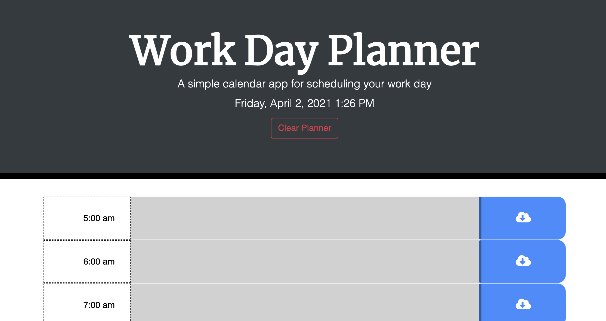
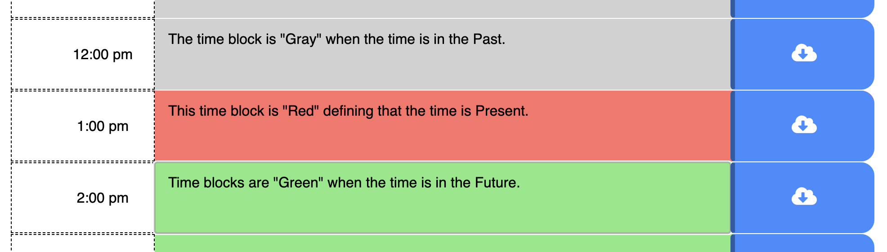
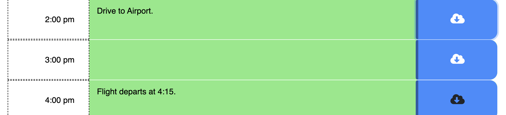

# Work Day Planner

---

## Site Introduction

The single page work day planner enables users to schedule events from 5:00 am to 5:00 pm.

This calendar app features:
* Current Day, Date, and Time on Page Load / Refresh
* Console and Local Storage Logging
* Button for Saving Text within Time Frame
* Button for Clearing and Reloading Scheduled Days (after Save)
* Color Coded Planning for Easier Site Navigation
* Google Fonts and Font Awesome Icons
* Hover Elements

### Time Blocks

The "time blocks" represent (in present time) the Time, Text Area, and Save Button.

The blocks are displayed in three (3) colors representing the following time frames:
* Gray: Past
* Red: Present
* Green: Future

### Buttons

The Save Button utilizes script to log and store the information input by the user in the designated text area.
* The button is distinguished by the color "Blue" and the "Cloud" icon.

The Clear Button utilizes script to clear and reload the information input by the user present on the planner and in the Local Sotrage.
* The button is distinguished by the color "Blue" and the "Cloud" icon.

---